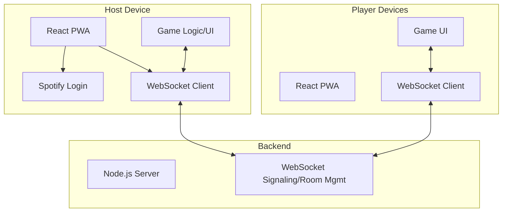

# Application Requirements Document (ARD): GuessTheSong

## 1. Overview

GuessTheSong is a real-time, multiplayer music quiz game designed for groups of people in the same physical location. One player acts as the host, providing Spotify Premium authentication and controlling the game flow. Other players join via an invitation link and compete to guess song titles and artists. The game is designed as a Progressive Web App (PWA) for seamless cross-device compatibility and minimal server costs.

---

## 2. Key Requirements & Constraints

- **Host must have Spotify Premium** (required for playback via Spotify Web Playback SDK).
- **Players join via invitation link or room code**; no Spotify account required for players.
- **Game runs as a PWA** for mobile and desktop browsers.
- **Minimal backend**: Only for signaling, room management, and real-time events (WebSockets).
- **No audio streaming to players**: Only the host's device plays music.

---

## 3. Technology Stack

| Layer         | Technology         | Rationale                                                                 |
|---------------|--------------------|---------------------------------------------------------------------------|
| Frontend      | React (PWA)        | Mature, widely supported, great PWA tooling, easy to scale and maintain   |
| Real-time     | WebSockets         | Reliable, low-latency, works well for multiplayer game state sync         |
| Backend       | Node.js + ws/socket.io | Lightweight, easy to deploy, minimal cost, good WebSocket support         |
| Spotify API   | Spotify Web Playback SDK (host only) | Required for playback/auth, host-only simplifies integration              |

---

## 4. Game Flow

### Host

1. Open app, log in with Spotify.
2. Create game room (room code/link generated).
3. Select playlist.
4. Share invite link/QR code with players.
5. Start game: random song plays.
6. See buzzes, judge answers, award points.
7. Game ends when a player reaches 10 points.

### Player

1. Open invite link or enter room code.
2. Enter nickname.
3. Wait for host to start.
4. Buzz in when ready.
5. Submit answer if first to buzz.
6. See scores and game state.

---

## 5. UI Wireframe Overview

```mermaid
flowchart TD
    H1[Host: Login/Spotify Auth]
    H2[Host: Create Room]
    H3[Host: Select Playlist]
    H4[Host: Share Invite]
    H5[Host: Game Screen (Play, Buzzes, Judge)]
    H6[Host: End Screen]

    P1[Player: Join Room]
    P2[Player: Enter Nickname]
    P3[Player: Waiting Room]
    P4[Player: Game Screen (Buzz, Answer)]
    P5[Player: End Screen]

    H1 --> H2 --> H3 --> H4 --> H5 --> H6
    P1 --> P2 --> P3 --> P4 --> P5
    H4 --> P1
```

---

## 6. Backend Responsibilities

- Room creation/joining (room codes, player lists)
- Real-time events: player join/leave, buzz, answer, score updates
- Host controls: start game, play song, judge answer, next round
- No audio streaming—only game state

---

## 7. Spotify Integration

- **Host-only authentication** using Spotify OAuth 2.0 Authorization Code Flow.
- Required scopes: `streaming`, `user-read-email`, `user-read-private`, `playlist-read-private`, `playlist-read-collaborative`.
- Host’s access token initializes the Spotify Web Playback SDK in the browser.
- Host selects playlist and plays tracks; playback state managed on host.
- Players do not need Spotify accounts or playback capability.

---

## 8. MVP User Stories

- As a host, I can log in with Spotify and create a game room.
- As a host, I can select a playlist and start the game.
- As a player, I can join a game via link or code and enter my nickname.
- As a player, I can buzz in and answer when a song is playing.
- As a host, I can see who buzzed first and judge answers.
- As a player, I can see scores and game progress in real time.
- The game ends when a player reaches 10 points.

---

## 9. Architecture Diagram



---

## 10. Open Questions

- Any additional Spotify features needed (e.g., playlist search, collaborative playlists)?
- Any branding, design, or accessibility requirements?
- Should the game support desktop browsers in addition to mobile?
